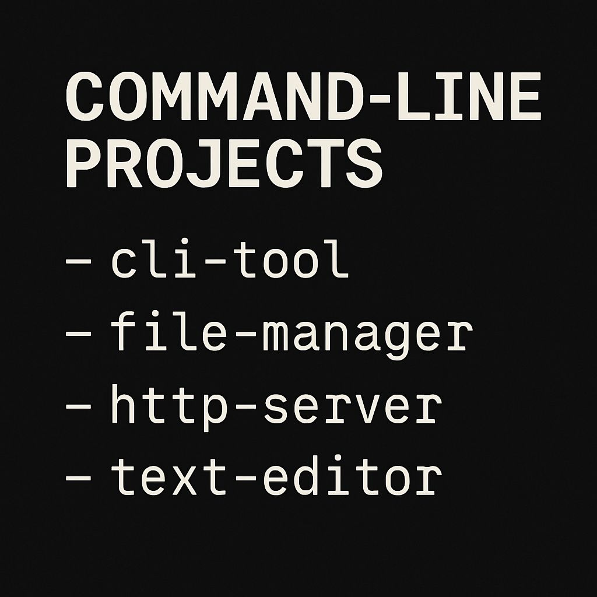

# 🛠️ Create - Setup & Run Guide

Welcome to the setup guide for this Command Line (CMD) based project. This document will help you get started, from installation to usage.

---

## 📁 Project Overview

This is a command-line project designed for ease of use, quick execution, and customization. Whether you're running commands, automating tasks, or extending the tool—this guide will help you start fast.

---

## ✅ Requirements

Make sure the following are installed:

- Python 3.7 or higher (more languages also)
- `pip` package manager
- Git (optional, if cloning)
- Terminal or Command Prompt

---

